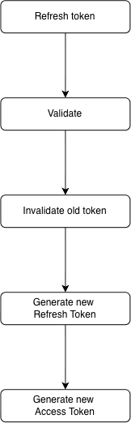

# Auth service

Authentication service for the Auth Platform.

The service is responsible for user authentication, JWT token management, refresh token rotation, token validation, and session invalidation.

## Overview

**auth-auth** is a backend microservice responsible for authentication and token lifecycle management.

The service is not responsible for user management or access control. These responsibilities are delegated to separate services.

Responsibilities

- User authentication
- Password verification
- Access token generation
- Refresh token generation
- Refresh token rotation
- Access token validation
- Refresh token validation
- Session invalidation
- Logout
- Token expiration management

## Access Tokens

Access tokens are JWTs used to authenticate requests.

The access token contains the information required by the API Gateway to identify the user and validate the token.

The service is responsible for:

- token generation;
- token signature validation;
- expiration validation;
- extracting claims;
- validating the token structure.

Access tokens are short-lived.

## Refresh Tokens

Refresh tokens are used to obtain new access tokens without requiring the user to authenticate again.

Refresh tokens are stored in Redis and are subject to rotation.

The general flow is:

This prevents reuse of an already rotated refresh token.

## Dependencies

| Dependency | Purpose                                 |
| ---------- | --------------------------------------- |
| auth-user  | User lookup and user-related operations |
| Redis      | Refresh token/session storage           |
| Vault      | Secrets and sensitive configuration     |
| gRPC       | Service-to-service communication        |

## Security

The service follows several security principles:

- Passwords are never stored in plain text.
- Access tokens have a short lifetime.
- Refresh tokens have a longer lifetime.
- Refresh tokens are stored server-side.
- Refresh token rotation prevents token replay.
- Secrets are managed through HashiCorp Vault.
- Access tokens are validated before protected requests are forwarded.
- Authentication logic is isolated from authorization logic.
